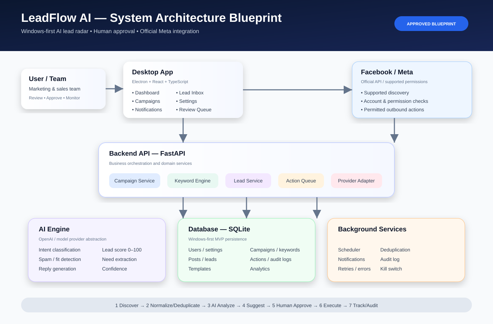

# LeadFlow AI Architecture Blueprint

This document is the canonical technical architecture reference.

## Master visual

The SVG is intentionally detailed enough to show implementation modules and the safety/approval boundary. It is not a substitute for the text specifications below.

## Companion specifications

- [Detailed Architecture](./detailed-architecture.md)
- [Data Flow & State Transitions](./data-flow.md)
- [Security & Safety](./security-safety.md)
- [Data Model](../data/data-model.md)
- [API Contract](../api/api-contract.md)
- [ADRs](./decisions/)

## System layers

### 1. Windows Desktop
Electron, React and TypeScript provide the desktop shell and UI information architecture:
Dashboard, Campaigns, Keywords, Groups & Fanpages, Lead Inbox, Messages & Comments, Templates, AI Assistant, Analytics, Activity Log and Settings.

### 2. Backend API
FastAPI owns validation, orchestration and business rules:
API routers, campaign service, discovery, keyword engine, deduplication, lead service, AI orchestration, reply service, approval/action queue, rate limiting, safety, notifications, analytics and audit.

### 3. AI Engine
The AI layer produces structured advisory output:
- intent classification
- lead score 0–100
- fit/spam detection
- need extraction
- suggested reply
- confidence
- model/prompt metadata

### 4. Data
SQLite is the Windows-first MVP store behind a repository layer. Core entities include users, provider accounts, campaigns, keywords, source targets, posts, leads, AI analyses, suggestions, approvals, actions, attempts, templates, audit events and notifications.

### 5. External providers
Meta and AI services are isolated behind adapters. Provider capability checks are performed before execution.

### 6. Background services
Scheduler, retries/backoff, deduplication, notifications, analytics aggregation and health checks run outside the React UI.

## Approval boundary

Discover → Normalize → Match → Deduplicate → AI Analyze → Suggest → Human Review → Explicit Approve → Server-side Checks → Action Queue → Execute → Audit → Track.

AI recommends; only an explicit user approval can authorize an outbound action.

## Blueprint status

Status: Approved production-direction blueprint.

Any structural change must update the relevant specification and, when architectural, an ADR.
